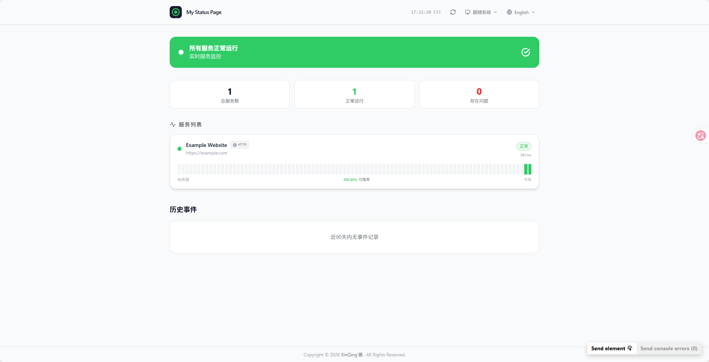

# PulseBoard

**English** | [中文](./README.zh-CN.md)

A self-hosted, real-time service monitoring status page. Monitor your HTTP endpoints, TCP ports, and hosts via Ping — all from a beautiful, responsive dashboard.



## Features

- **Multi-protocol monitoring** — HTTP/HTTPS, TCP port, Ping (ICMP)
- **90-day uptime history** — daily bar chart with hover tooltips
- **Incident management** — create incidents, append timeline updates, track resolution
- **Admin authentication** — email OTP login (no passwords stored)
- **Site customization** — site name, description, refresh interval, data retention
- **Dark / Light theme** — follows system preference or manual toggle
- **Internationalization** — English and Chinese (中文) built-in
- **Hide host/IP** — per-service toggle to hide internal addresses from the public
- **Responsive UI** — works on desktop and mobile

## Tech Stack

| Layer | Technology |
|---|---|
| Frontend | React 18 + Vite + TailwindCSS |
| Backend | Node.js + Express |
| Database | sql.js (SQLite, no native deps) |
| Auth | Email OTP via Nodemailer |
| Icons | Lucide React |
| i18n | i18next |

## Getting Started

### Prerequisites

- Node.js 18+
- npm 9+

### Install

```bash
git clone https://github.com/XingChenwa/status_uptime2.0.git
cd status_uptime2.0
npm install
```

### Development

```bash
npm run dev
```

- Frontend: http://localhost:5173
- Backend API: http://localhost:3001

### Production Build

```bash
npm run build   # Build frontend to dist/
npm start       # Serve frontend + API on :3001
```

## Configuration

On first run, visit `http://localhost:3001/sadmin` to complete setup:

1. Configure your SMTP server for email delivery
2. Set your admin email address
3. Log in via OTP sent to your email

Site settings (name, description, refresh interval) can be changed from the admin dashboard.

## Project Structure

```
pulseboard/
├── public/
│   └── favicon.svg          # Site favicon
├── src/
│   ├── components/
│   │   ├── ConfirmDialog.jsx # Reusable confirm modal
│   │   ├── Header.jsx        # Top navigation bar
│   │   ├── ServiceCard.jsx   # Service status card
│   │   ├── ServiceModal.jsx  # Add / edit service modal
│   │   ├── SettingsModal.jsx # Site settings modal
│   │   └── UptimeBar.jsx     # 90-day uptime bar chart
│   ├── contexts/
│   │   ├── AuthContext.jsx   # Admin auth state
│   │   └── ThemeContext.jsx  # Dark / light theme
│   ├── i18n/
│   │   ├── index.js          # i18next setup
│   │   └── locales/
│   │       ├── en.json       # English translations
│   │       └── zh.json       # Chinese translations
│   ├── pages/
│   │   ├── AdminDashboard.jsx
│   │   ├── AdminLogin.jsx
│   │   ├── AdminPage.jsx
│   │   ├── AdminSetup.jsx
│   │   └── StatusPage.jsx    # Main public status page
│   ├── App.jsx
│   ├── index.css
│   └── main.jsx
├── server.js                 # Express API + scheduler
├── status.db                 # SQLite database (auto-created)
├── package.json
└── vite.config.js
```

## Environment Variables

| Variable | Default | Description |
|---|---|---|
| `PORT` | `3001` | Port the server listens on |

## Data Storage

All data is persisted in `status.db` (SQLite via sql.js) in the project root. Back up this file to preserve your service history and configuration.

## License

MIT © [XingChenwa](./LICENSE)
